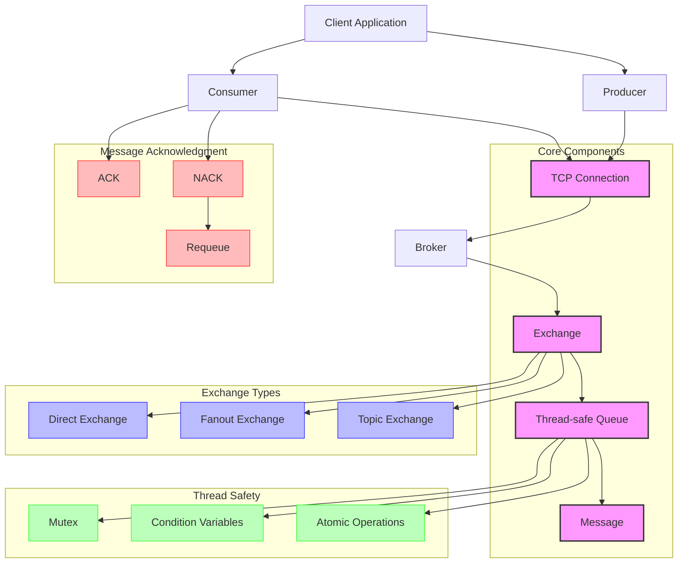

# RabbitMQ Client Architecture

## Component Description

### Core Components

1. **Message**: Message structure containing message content, routing key, exchange name, and other information
2. **Queue**: Thread-safe queue implementation using mutexes and condition variables to ensure thread safety
3. **Connection**: TCP connection management handling communication between clients and server
4. **Exchange**: Exchange responsible for message routing

### Exchange Types

1. **Direct Exchange**: Routes messages to queues based on exact routing key matching
2. **Fanout Exchange**: Broadcasts messages to all bound queues regardless of routing key
3. **Topic Exchange**: Routes messages to queues based on pattern-matching routing keys

### Thread Safety Mechanisms

1. **Mutex**: Ensures only one thread can access shared resources at a time
2. **Condition Variables**: Used for thread notification and waiting
3. **Atomic Operations**: Ensures operation atomicity

### Message Acknowledgment Mechanisms

1. **ACK**: Message acknowledgment indicating successful processing
2. **NACK**: Message rejection indicating processing failure
3. **Requeue**: Puts rejected messages back into the queue

## Data Flow

1. Producers send messages to the Broker via TCP connection
2. Broker routes messages to appropriate queues based on exchange and routing key
3. Consumers receive messages from the Broker via TCP connection
4. Consumers process messages and send acknowledgment or rejection
5. If a message is rejected with requeue option, it's put back into the queue
